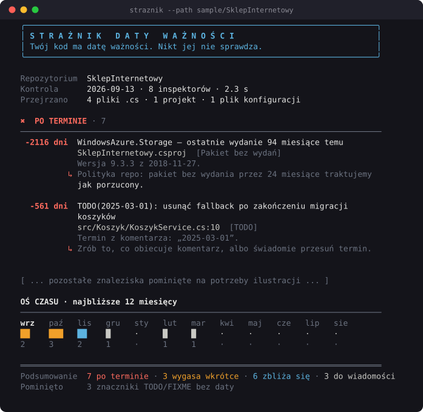
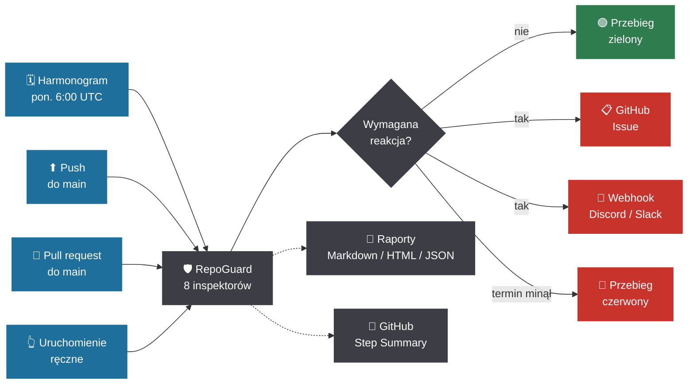

````markdown
# 🛡️ RepoGuard — Strażnik Daty Ważności

**Automatyczna analiza terminów, wygasających elementów i długu technicznego w repozytoriach .NET.**

RepoGuard analizuje kod źródłowy, konfigurację i zależności projektu, wyszukując elementy powiązane z terminem ważności, wycofania lub planowanego usunięcia.

Wyniki są klasyfikowane według pilności i przedstawiane w formie raportu oraz osi czasu. Narzędzie może działać lokalnie albo automatycznie w GitHub Actions.

<p align="center">
  
</p>

<p align="center">
  <sub>Obraz wygenerowany z rzeczywistego wyjścia programu przez <a href="docs/ansi2svg.py"><code>docs/ansi2svg.py</code></a> — nie jest to makieta.</sub>
</p>

> Projekt przygotowany na konkurs **„Strażnik”** — StormIT × Helion × inkBOOK, Dzień Programisty 2026.  
> Hasło edycji: *404? NOT TODAY!*

---

## Problem

W repozytoriach często znajdują się elementy, których znaczenie lub poprawność jest powiązana z określonym terminem.

Może to być na przykład komentarz techniczny:

```csharp
// TODO(2025-03-01): usunąć fallback po zakończeniu migracji koszyków
private const bool UzywajStaregoZapisu = true;
```

Jeżeli termin minie, sam kod nadal może działać poprawnie, dlatego taki przypadek nie zostanie wykryty przez kompilator ani standardowe testy.

Podobny problem dotyczy również:

- tymczasowych feature flag,
- elementów oznaczonych `[Obsolete]`,
- tokenów i certyfikatów z określoną datą ważności,
- wersji `TargetFramework` z kończącym się okresem wsparcia,
- pakietów NuGet, które zostały wycofane lub od dawna nie są rozwijane,
- dat zapisanych bezpośrednio w kodzie lub konfiguracji.

Informacje te są rozproszone pomiędzy kodem źródłowym, plikami konfiguracyjnymi i zależnościami projektu. RepoGuard zbiera je w jednym miejscu, określa ich pilność i prezentuje jako uporządkowany raport.

## Czego pilnuje

| Inspektor | Co znajduje | Sieć |
|---|---|:--:|
| **Datowane komentarze** | `TODO(2026-03-01)`, `HACK do końca marca 2026`, `FIXME Q2 2027` — w komentarzach, nie w literałach tekstowych | — |
| **Wycofane API** | `[Obsolete]` z terminem lub datą wycofania oraz liczbą pozostałych użyć w repozytorium | — |
| **Daty w kodzie** | `new DateTime(2026, 11, 1)` — daty mogące wpływać na późniejsze zachowanie aplikacji | — |
| **Feature flagi** | flagi z polem `expires`, `removeAfter` lub podobnym wraz z ich aktualnym stanem | — |
| **Wsparcie .NET** | `TargetFramework` i `global.json` zestawione z datami końca wsparcia platformy | — |
| **Tokeny i certyfikaty** | claim `exp` w JWT-ach z konfiguracji oraz `NotAfter` w plikach `.pfx`, `.cer` i `.pem` | — |
| **Certyfikaty TLS** | daty ważności certyfikatów wskazanych domen | ✓ |
| **Zależności NuGet** | pakiety wycofane, ukryte, zawierające zgłoszone podatności lub od dawna niewydawane | ✓ |

Inspektory wymagające dostępu do sieci są domyślnie wyłączone. Pozostała część analizy działa lokalnie.

## Szybki start

```bash
dotnet build
dotnet run --project src/Straznik.Cli -- --path .
```

Na przykładowym, celowo zaniedbanym repozytorium z `sample/`:

```bash
dotnet run --project src/Straznik.Cli -- --path sample/SklepInternetowy --today 2026-09-13
```

Przykładowy wynik:

```text
  ╭──────────────────────────────────────────────────────────────────────────╮
  │ S T R A Ż N I K   D A T Y   W A Ż N O Ś C I                           │
  │ Twój kod ma datę ważności. Nikt jej nie sprawdza.                       │
  ╰──────────────────────────────────────────────────────────────────────────╯

  Repozytorium  SklepInternetowy
  Kontrola      2026-09-13 · 8 inspektorów · 2.0 s
  Przejrzano    4 pliki .cs · 1 projekt · 1 plik konfiguracji

  ✖  PO TERMINIE · 7
  ────────────────────────────────────────────────────────────────────────────
   -2116 dni  WindowsAzure.Storage — ostatnie wydanie 94 miesiące temu
              SklepInternetowy.csproj  [Pakiet bez wydań]
              Wersja 9.3.3 z 2018-11-27.
            ↳ Polityka repo: pakiet bez wydania przez 24 miesiące traktujemy
              jak porzucony.

    -561 dni  TODO(2025-03-01): usunąć fallback po zakończeniu migracji
              koszyków
              src/Koszyk/KoszykService.cs:10  [TODO]
              Termin z komentarza: „2025-03-01”.
            ↳ Zrób to, co obiecuje komentarz, albo świadomie przesuń termin.

    -531 dni  [Obsolete] klasa StaryKlientApi
              src/Legacy/StaryKlientApi.cs:7  [Wycofane]
              Wycofane od 2024-03. Zastąpione przez KlientApi. · brak użyć w
              repozytorium — można usuwać · Wycofane 2024-03 — 30 miesięcy
              temu.
            ↳ Polityka repo: sprzątamy 12 miesięcy po wycofaniu.

    -469 dni  FeatureFlags/nowyKoszyk — nadal włączona, termin 2025-06-01
              appsettings.Production.json:16 → FeatureFlags/nowyKoszyk
              Właściciel: zespol-checkout
            ↳ Flaga po terminie to martwy kod po jednej ze stron ifa.

  [...]

  OŚ CZASU · najbliższe 12 miesięcy
  ────────────────────────────────────────────────────────────────────────────
  wrz   paź   lis   gru   sty   lut   mar   kwi   maj   cze   lip   sie
  ██    ███   ██    █     ·     █     █     ·     ·     ·     ·     ·
  2     3     2     1     ·     1     1     ·     ·     ·     ·     ·

  ════════════════════════════════════════════════════════════════════════════
  Podsumowanie  7 po terminie · 3 wygasa wkrótce · 6 zbliża się · 3 do wiadomości
  Pominięto     3 znaczniki TODO/FIXME bez daty
```

Oś czasu uzupełnia listę znalezisk, pokazując rozkład terminów w kolejnych miesiącach.

Data `2026-09-13` jest w przykładzie podawana jawnie przez opcję `--today`. Dzięki temu wynik demonstracji pozostaje deterministyczny.

## Rozpoznawanie terminów

RepoGuard rozpoznaje kilka formatów zapisu dat i terminów używanych w kodzie oraz komentarzach.

| Zapis | Termin |
|---|---|
| `TODO(2026-03-01)` | 1 marca 2026 |
| `01.03.2026` | 1 marca 2026 |
| `TODO(2026-03)` | **koniec** marca 2026 |
| `do końca marca 2026` | koniec marca 2026 |
| `w lutym 2028` | koniec lutego 2028 |
| `remove by March 2026` | koniec marca 2026 |
| `Q2 2026` | koniec czerwca 2026 |

Terminy zapisane tylko z dokładnością do miesiąca lub kwartału są interpretowane jako ostatni dzień danego okresu.

## Dlaczego Roslyn, a nie `grep`

```csharp
string komunikat = "TODO(2020-01-01): to tylko tekst dla użytkownika";
```

`grep` zgłosi taki tekst jako pasujące wystąpienie. RepoGuard analizuje drzewo składni Roslyna i rozpoznaje, że jest to literał tekstowy, a nie komentarz zawierający termin.

Ta różnica jest objęta testem:

```text
Znacznik_w_literale_tekstowym_nie_jest_znaleziskiem
```

Analiza jest czysto składniowa — nie wymaga kompilacji badanego repozytorium ani wykonywania jego `restore`.

Dzięki temu RepoGuard może przeanalizować również projekt, którego w danym momencie nie da się zbudować.

## Automatyczne uruchamianie

RepoGuard może być uruchamiany automatycznie przez GitHub Actions:

- zgodnie z harmonogramem,
- po pushu do `main`,
- przy pull requeście do `main`,
- ręcznie przez `workflow_dispatch`.

Dzięki temu analiza może zostać wykonana zarówno okresowo, jak i podczas wprowadzania zmian do repozytorium.



### GitHub Actions

Gotowy workflow znajduje się w:

[`.github/workflows/straznik.yml`](.github/workflows/straznik.yml)

Workflow może zostać uruchomiony na cztery sposoby:

- **w każdy poniedziałek o 6:00 UTC** (`schedule`),
- **przy pushu do `main`**,
- **przy pull requeście do `main`**,
- **ręcznie** (`workflow_dispatch`).

W ramach jednego przebiegu RepoGuard:

1. buduje aplikację w konfiguracji `Release`,
2. analizuje właściwe repozytorium,
3. tworzy raporty w formatach **Markdown, HTML i JSON**,
4. umieszcza raport Markdown w **GitHub Step Summary**,
5. przeprowadza dodatkową analizę repozytorium demonstracyjnego `sample/SklepInternetowy`,
6. zapisuje raporty jako artefakty GitHub Actions przez **90 dni**,
7. wysyła webhook, jeżeli wykryto elementy po terminie albo wygasające wkrótce,
8. tworzy lub aktualizuje GitHub Issue, jeżeli wykryto elementy po terminie,
9. na końcu ustawia kod zakończenia odpowiedni dla wyniku analizy.

Artefakt zawiera:

```text
raport.md
raport.html
raport.json
raport-demo.md
raport-demo.html
```

Krok ustalający końcowy wynik przebiegu jest wykonywany jako ostatni. Dzięki temu raporty i powiadomienia mogą zostać utworzone również wtedy, gdy analiza zakończy workflow błędem.

Webhook jest wysyłany tylko wtedy, gdy analiza wykryje element wymagający uwagi.

### Lokalnie — cron / Harmonogram zadań

RepoGuard nie wymaga GitHub Actions.

Przykładowe cykliczne uruchamianie:

```bash
# codziennie o 8:00
0 8 * * *  cd /repo && straznik --quiet --webhook "$STRAZNIK_WEBHOOK_URL"
```

## Powiadomienia

```bash
straznik --webhook https://discord.com/api/webhooks/...
straznik --webhook https://hooks.slack.com/services/...

export STRAZNIK_WEBHOOK_URL=...
```

Format wiadomości jest dobierany na podstawie adresu webhooka.

Do powiadomienia trafiają najpilniejsze pozycje, natomiast pełny wynik analizy pozostaje dostępny w raporcie.

## Konfiguracja

Domyślna konfiguracja może zostać utworzona poleceniem:

```bash
straznik init
```

Powstaje wtedy plik `straznik.json`.

Przykład:

```jsonc
{
  "warnWithinDays": 30,
  "noticeWithinDays": 90,

  "exclude": [
    "**/bin/**",
    "**/obj/**",
    "**/Migrations/**"
  ],

  "datedComments": {
    "markers": [
      "TODO",
      "FIXME",
      "HACK",
      "XXX",
      "TEMP",
      "TYMCZASOWO"
    ],
    "reportUndated": false
  },

  "obsolete": {
    "staleAfterMonths": 12
  },

  "nuGet": {
    "enabled": false,
    "staleAfterMonths": 24
  },

  "tls": {
    "enabled": false,
    "hosts": [
      "moja-domena.pl"
    ]
  }
}
```

`reportUndated` jest domyślnie wyłączone.

Znaczniki `TODO`, `FIXME` i podobne, które nie zawierają daty, są zliczane i prezentowane w podsumowaniu, ale nie powodują utworzenia osobnego znaleziska.

Pozwala to ograniczyć liczbę informacji niezwiązanych bezpośrednio z terminem.

## Świadome wyjątki

Nie każda data znajdująca się w kodzie powinna zostać potraktowana jako termin wymagający reakcji.

Przykładem może być data używana w dokumentacji, danych testowych albo jako stała referencyjna.

W takim przypadku można zastosować znacznik:

```csharp
// TODO(2026-03-01): przykład w dokumentacji (straznik:ignore)

static readonly DateTime TerminUstawowy =
    new(2027, 1, 1); // straznik:ignore
```

RepoGuard pomija również daty znajdujące się w inicjalizatorach kolekcji. Pozwala to odróżnić dane referencyjne, takie jak tablice dat lub słowniki, od dat wpływających na zachowanie aplikacji.

## Formaty i kody wyjścia

```bash
straznik --format console

straznik --format markdown --out raport.md
straznik --format html     --out raport.html
straznik --format json     --out raport.json

straznik --ascii --no-color
```

Dostępne formaty:

- `console` — domyślny raport terminalowy,
- `markdown` — raport przeznaczony m.in. do CI i GitHub Step Summary,
- `html` — samodzielny raport do otwarcia w przeglądarce,
- `json` — format przeznaczony do dalszego przetwarzania i integracji.

| Kod | Znaczenie |
|:--:|---|
| `0` | brak problemu spełniającego wybrany próg albo użyto `--fail-on none` |
| `1` | wykryto element wygasający wkrótce przy `--fail-on expiring` |
| `2` | wykryto element po terminie |

## RepoGuard analizuje również własne repozytorium

Repozytorium zawiera własny plik [`straznik.json`](straznik.json), a workflow GitHub Actions wykonuje cykliczną analizę jego zawartości.

Podczas tworzenia narzędzia analiza wykryła w jego własnym kodzie cztery przeterminowane `TODO`. Znajdowały się one w komentarzach dokumentacyjnych opisujących format:

```text
TODO(2026-03-01)
```

jako przykład.

Na tej podstawie dodany został mechanizm `straznik:ignore`, umożliwiający świadome pomijanie takich przypadków.

## Architektura

```text
src/Straznik.Core/
  Model/          Finding, Severity, ScanResult
  Dates/          DateHunter, Grader
  Scanning/       Guard, FileScanner, SyntaxCache
  Inspectors/     osiem inspektorów
  Reporting/      Console, Markdown, HTML, JSON, Timeline
  Notifications/  WebhookNotifier

src/Straznik.Cli/
  interfejs wiersza poleceń

tests/
  78 testów

sample/
  repozytorium demonstracyjne zawierające celowo przygotowane problemy
```

Każdy inspektor implementuje wspólny kontrakt.

Przykład:

```csharp
public sealed class MojInspector : SyncInspector
{
    public override string Id => "moj";
    public override string DisplayName => "Mój inspektor";

    public override bool IsEnabled(StraznikConfig config) => true;

    protected override IEnumerable<Finding> Inspect(
        ScanContext ctx,
        CancellationToken ct)
    {
        yield return ctx.Grader.WithDeadline(
            new Finding
            {
                /* ... */
            },
            new DateOnly(2027, 1, 1));
    }
}
```

`Grader` odpowiada za wspólne zasady klasyfikowania terminów według pilności.

Pliki `.cs` są parsowane raz i współdzielone pomiędzy inspektorami przez `SyntaxCache`.

Błąd pojedynczego inspektora nie zatrzymuje pozostałych analiz. Informacja o problemie z jego wykonaniem może zostać uwzględniona w raporcie.

## Testy

```bash
dotnet test
```

Aktualny zestaw:

```text
78 testów
78 zakończonych powodzeniem
0 niepowodzeń
0 pominiętych
```

Testy są offline i deterministyczne.

Data kontroli może zostać jawnie określona:

```bash
--today 2026-09-13
```

Dzięki temu ten sam scenariusz testowy może zostać uruchomiony z identyczną datą odniesienia niezależnie od aktualnego dnia.

## Ograniczenia

Zakres działania RepoGuard jest celowo ograniczony do analizy terminów i elementów powiązanych z ich upływem.

- **Analiza użyć nie jest semantyczna.** Wystąpienia nazw są zliczane na podstawie składni, dlatego elementy o identycznych nazwach mogą zostać zsumowane.
- **Daty końca wsparcia .NET są przechowywane lokalnie.** Pozwala to działać offline, ale wymaga aktualizacji danych po pojawieniu się nowych wersji platformy.
- **Zmienne MSBuild nie są interpretowane.** Konstrukcja taka jak `<TargetFramework>$(Cos)</TargetFramework>` zostanie pominięta.
- **Numery linii w plikach JSON są przybliżone.** Standardowy odczyt przez `System.Text.Json` nie udostępnia dokładnej lokalizacji każdego tokenu.
- **RepoGuard nie zastępuje dedykowanych skanerów bezpieczeństwa.** W przypadku pakietów NuGet prezentuje informacje udostępniane przez nuget.org, natomiast szczegółową analizę podatności można przeprowadzić niezależnymi narzędziami.

## Licencja

MIT.
````
