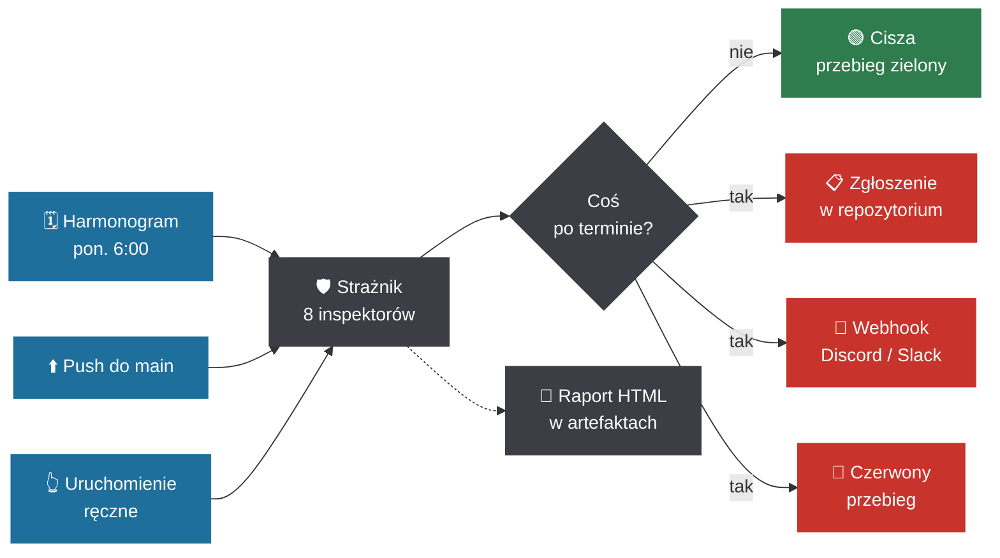

# 🛡️ RepoGuard — Strażnik Daty Ważności

**Automatyczna analiza terminów, wygasających elementów i długu technicznego w repozytoriach .NET.**

RepoGuard analizuje kod źródłowy, konfigurację i zależności projektu, wyszukując elementy powiązane z terminem ważności, wycofania lub planowanego usunięcia.

Wyniki są klasyfikowane według pilności i przedstawiane w formie raportu oraz osi czasu. Narzędzie może działać lokalnie albo automatycznie w GitHub Actions.

<p align="center">
  
</p>

<p align="center">
  <sub>Obraz wygenerowany z rzeczywistego wyjścia programu przez <a href="docs/ansi2svg.py"><code>docs/ansi2svg.py</code></a> — nie jest to makieta.</sub>
</p>

> Projekt na konkurs **„Strażnik"** — StormIT × Helion × inkBOOK, Dzień Programisty 2026.
> Hasło edycji brzmi *404? NOT TODAY!*. Bo 404 zauważysz w pięć minut. Przeterminowanego `TODO` nie zauważysz nigdy.

---

## Problem

W repozytoriach często znajdują się elementy, których znaczenie lub poprawność jest powiązana z określonym terminem.

Może to być na przykład komentarz techniczny:

```csharp
// TODO(2025-03-01): usunąć fallback po zakończeniu migracji koszyków
private const bool UzywajStaregoZapisu = true;
## Czego pilnuje

| Inspektor | Co znajduje | Sieć |
|---|---|:--:|
| **Datowane komentarze** | `TODO(2026-03-01)`, `HACK do końca marca 2026`, `FIXME Q2 2027` — w komentarzach, nie w stringach | — |
| **Wycofane API** | `[Obsolete]` z terminem lub datą wycofania + liczba pozostałych użyć w repo | — |
| **Daty w kodzie** | `new DateTime(2026, 11, 1)` — dni, w których kod zacznie zachowywać się inaczej | — |
| **Feature flagi** | flagi z polem `expires` / `removeAfter`, które nadal są włączone | — |
| **Wsparcie .NET** | `TargetFramework` i `global.json` kontra oficjalne daty końca wsparcia | — |
| **Tokeny i certyfikaty** | claim `exp` w JWT-ach z konfiguracji, `NotAfter` w plikach `.pfx`/`.cer`/`.pem` | — |
| **Certyfikaty SSL** | ważność certyfikatów domen znalezionych w konfiguracji | ✓ |
| **Zależności NuGet** | pakiety wycofane przez autora, z podatnościami, ukryte lub bez wydania od lat | ✓ |

Inspektory sieciowe są domyślnie **wyłączone** — bez internetu Strażnik działa tak samo, tylko widzi mniej.

## Szybki start

```bash
dotnet build
dotnet run --project src/Straznik.Cli -- --path .
```

Na przykładowym, celowo zaniedbanym repozytorium z `sample/`:

```bash
dotnet run --project src/Straznik.Cli -- --path sample/SklepInternetowy --today 2026-09-13
```

```
  ╭──────────────────────────────────────────────────────────────────────────╮
  │ S T R A Ż N I K   D A T Y   W A Ż N O Ś C I                              │
  │ Twój kod ma datę ważności. Nikt jej nie sprawdza.                        │
  ╰──────────────────────────────────────────────────────────────────────────╯

  Repozytorium  SklepInternetowy
  Kontrola      2026-09-13 · 8 inspektorów · 2.0 s
  Przejrzano    4 pliki .cs · 1 projekt · 1 plik konfiguracji

  ✖  PO TERMINIE · 7
  ────────────────────────────────────────────────────────────────────────────
   -2116 dni  WindowsAzure.Storage — ostatnie wydanie 94 miesiące temu
              SklepInternetowy.csproj  [Pakiet bez wydań]
              Wersja 9.3.3 z 2018-11-27.
            ↳ Polityka repo: pakiet bez wydania przez 24 miesiące traktujemy
              jak porzucony.

    -561 dni  TODO(2025-03-01): usunąć fallback po zakończeniu migracji
              koszyków
              src/Koszyk/KoszykService.cs:10  [TODO]
              Termin z komentarza: „2025-03-01”.
            ↳ Zrób to, co obiecuje komentarz, albo świadomie przesuń termin.

    -531 dni  [Obsolete] klasa StaryKlientApi
              src/Legacy/StaryKlientApi.cs:7  [Wycofane]
              Wycofane od 2024-03. Zastąpione przez KlientApi. · brak użyć w
              repozytorium — można usuwać · Wycofane 2024-03 — 30 miesięcy
              temu.
            ↳ Polityka repo: sprzątamy 12 miesięcy po wycofaniu.

    -469 dni  FeatureFlags/nowyKoszyk — nadal włączona, termin 2025-06-01
              appsettings.Production.json:16 → FeatureFlags/nowyKoszyk  [Feature flaga]
              Właściciel: zespol-checkout
            ↳ Flaga po terminie to martwy kod po jednej ze stron ifa.

  [...]

  OŚ CZASU · najbliższe 12 miesięcy
  ────────────────────────────────────────────────────────────────────────────
  wrz   paź   lis   gru   sty   lut   mar   kwi   maj   cze   lip   sie
  ██    ███   ██    █     ·     █     █     ·     ·     ·     ·     ·
  2     3     2     1     ·     1     1     ·     ·     ·     ·     ·

  ════════════════════════════════════════════════════════════════════════════
  Podsumowanie  7 po terminie · 3 wygasa wkrótce · 6 zbliża się · 3 do wiadomości
  Pominięto     3 znaczniki TODO/FIXME bez daty
```

Oś czasu to sedno raportu: lista mówi *co*, oś mówi *kiedy się zagęści*.

## Jak Strażnik rozumie terminy

Programiści zapisują daty na kilkanaście sposobów, więc Strażnik rozumie kilkanaście sposobów:

| Zapis | Termin |
|---|---|
| `TODO(2026-03-01)` | 1 marca 2026 |
| `01.03.2026` | 1 marca 2026 |
| `TODO(2026-03)` | **koniec** marca 2026 |
| `do końca marca 2026` | koniec marca 2026 |
| `w lutym 2028` | koniec lutego 2028 |
| `remove by March 2026` | koniec marca 2026 |
| `Q2 2026` | koniec czerwca 2026 |

Terminy podane z dokładnością do miesiąca lub kwartału liczą się na **ostatni dzień** okresu — bo „do marca" znaczy „do końca marca".

## Dlaczego Roslyn, a nie `grep`

```csharp
string komunikat = "TODO(2020-01-01): to tylko tekst dla użytkownika";
```

`grep` zgłosi taki tekst jako pasujące wystąpienie. RepoGuard analizuje drzewo składni Roslyna i rozpoznaje, że jest to literał tekstowy, a nie komentarz zawierający termin.

Ta różnica jest objęta testem:

`Znacznik_w_literale_tekstowym_nie_jest_znaleziskiem`

Analiza jest **czysto składniowa** — bez kompilacji i bez `restore`. Dzięki temu Strażnik działa na repozytorium, którego akurat nie da się zbudować.

## Automatyczne uruchamianie

RepoGuard może być uruchamiany automatycznie przez GitHub Actions:

- zgodnie z harmonogramem,
- po pushu do `main`,
- przy pull requeście do `main`,
- ręcznie przez `workflow_dispatch`.

Dzięki temu analiza może zostać wykonana zarówno okresowo, jak i podczas wprowadzania zmian do repozytorium.



### GitHub Actions

Gotowy przepływ leży w [`.github/workflows/straznik.yml`](.github/workflows/straznik.yml). Workflow może zostać uruchomiony na cztery sposoby:

- **w każdy poniedziałek o 6:00 UTC** (`schedule`),
- **przy pushu do `main`**,
- **przy pull requeście do `main`**,
- **ręcznie** (`workflow_dispatch`).

Co robi z wynikiem:

1. wkleja raport w **podsumowanie przebiegu** (Markdown),
2. odkłada **`raport.html`** jako artefakt na 90 dni,
3. zakłada albo aktualizuje **zgłoszenie (issue)** z etykietą `straznik`, gdy coś jest po terminie,
4. wysyła **webhook**, ale tylko gdy naprawdę jest o czym mówić,
5. **czerwieni przebieg**, jeśli któryś termin minął.

Alert, który przychodzi co poniedziałek bez powodu, przestaje być alertem — dlatego krok 4 ma warunek.

### Lokalnie (cron / Harmonogram zadań)

```bash
# codziennie o 8:00, cicho, tylko powiadomienie gdy jest problem
0 8 * * *  cd /repo && straznik --quiet --webhook "$STRAZNIK_WEBHOOK_URL"
```

## Powiadomienia

```bash
straznik --webhook https://discord.com/api/webhooks/...
straznik --webhook https://hooks.slack.com/services/...
export STRAZNIK_WEBHOOK_URL=...   # albo przez zmienną środowiskową
```

Format wiadomości dobiera się sam na podstawie adresu (Discord / Slack / dowolny inny JSON). Do wiadomości trafia osiem najpilniejszych pozycji, reszta zostaje w pełnym raporcie.

## Konfiguracja

```bash
straznik init          # tworzy straznik.json z domyślnymi wartościami
```

```jsonc
{
  "warnWithinDays": 30,      // od kiedy "wygasa wkrótce"
  "noticeWithinDays": 90,    // od kiedy "zbliża się"

  "exclude": ["**/bin/**", "**/obj/**", "**/Migrations/**"],

  "datedComments": {
    "markers": ["TODO", "FIXME", "HACK", "XXX", "TEMP", "TYMCZASOWO"],
    "reportUndated": false   // znaczniki bez daty tylko się liczy, nie zgłasza
  },

  "obsolete":  { "staleAfterMonths": 12 },   // ile miesięcy tolerujemy [Obsolete]
  "nuGet":     { "enabled": false, "staleAfterMonths": 24 },
  "tls":       { "enabled": false, "hosts": ["moja-domena.pl"] }
}
```

Domyślnie `reportUndated` jest wyłączone. W typowym repozytorium są setki `TODO` bez daty i utopiłyby prawdziwe terminy — Strażnik je liczy i pokazuje samą skalę w podsumowaniu.

## Świadome wyjątki

Czasem data ma prawo tam być — przykład w dokumentacji, dana testowa, stała z ustawy:

```csharp
// TODO(2026-03-01): przykład w dokumentacji, nie zobowiązanie (straznik:ignore)
static readonly DateTime TerminUstawowy = new(2027, 1, 1); // straznik:ignore
```

Bez takiej furtki zespół wycisza całego Strażnika, a to gorsze niż jeden pominięty wiersz.

Strażnik pomija też z automatu daty w **inicjalizatorach kolekcji** — tablica dat końca wsparcia czy słownik świąt to dane referencyjne, a nie dzień, w którym coś się zmieni.

## Formaty i kody wyjścia

```bash
straznik --format console                      # domyślny, kolorowy
straznik --format markdown --out raport.md     # podsumowanie CI, treść zgłoszenia
straznik --format html     --out raport.html   # samodzielny dashboard, jasny i ciemny
straznik --format json     --out raport.json   # do własnych integracji
straznik --ascii --no-color                    # stare konsole
```

| Kod | Znaczenie |
|:--:|---|
| `0` | nic nie wygasa (albo `--fail-on none`) |
| `1` | coś wygasa wkrótce (przy `--fail-on expiring`) |
| `2` | coś jest po terminie |

## Strażnik pilnuje sam siebie

To repozytorium ma własny [`straznik.json`](straznik.json) i własny przebieg. Podczas budowy narzędzie znalazło w swoim kodzie cztery przeterminowane `TODO` — wszystkie w komentarzach dokumentacyjnych, które *opisywały* wzorzec `TODO(2026-03-01)` jako przykład. Stąd wzięła się funkcja `straznik:ignore`: pierwszym prawdziwym użytkownikiem Strażnika był Strażnik.

## Architektura

```
src/Straznik.Core/
  Model/          Finding, Severity, ScanResult
  Dates/          DateHunter (rozumienie terminów), Grader (termin → pilność)
  Scanning/       Guard (orkiestracja), FileScanner, SyntaxCache
  Inspectors/     osiem inspektorów za jednym interfejsem
  Reporting/      Console, Markdown, HTML, JSON, Timeline
  Notifications/  WebhookNotifier
src/Straznik.Cli/ interfejs wiersza poleceń
tests/            78 testów
sample/           celowo zaniedbane repozytorium demonstracyjne
```

Nowy inspektor to jedna klasa i jedna linijka w `Guard.Default()`:

```csharp
public sealed class MojInspector : SyncInspector
{
    public override string Id => "moj";
    public override string DisplayName => "Mój inspektor";
    public override bool IsEnabled(StraznikConfig config) => true;

    protected override IEnumerable<Finding> Inspect(ScanContext ctx, CancellationToken ct)
    {
        yield return ctx.Grader.WithDeadline(
            new Finding { /* ... */ },
            new DateOnly(2027, 1, 1));
    }
}
```

`Grader` jest wspólny, więc każdy inspektor ocenia czas tak samo. Pliki `.cs` są parsowane raz i współdzielone przez `SyntaxCache`. Inspektor, któremu coś nie wyjdzie, nie ucisza pozostałych — jego błąd trafia do sekcji „inspektorzy, którzy nie dokończyli", bo cichy monitoring jest gorszy niż żaden.

## Testy

```bash
dotnet test
```

78 testów, wszystkie offline i deterministyczne — data kontroli jest wstrzykiwana (`--today`), więc raport z 2026-09-13 wygląda tak samo dziś i za rok.

## Czego Strażnik nie robi

Uczciwie, bo monitoring, który udaje więcej niż potrafi, jest niebezpieczny:

- **Nie liczy użyć semantycznie.** Zlicza wystąpienia nazwy w składni, więc dwie różne klasy o tej samej nazwie zsumują się. To świadomy wybór: dzięki niemu Strażnik działa bez kompilacji repozytorium.
- **Tabela końca wsparcia .NET jest wbudowana**, żeby działać offline. Przy nowych wersjach platformy trzeba ją odświeżyć w `TargetFrameworkInspector`.
- **Nie czyta zmiennych MSBuild.** `<TargetFramework>$(Cos)</TargetFramework>` zostanie pominięty.
- **Numery linii w JSON są przybliżone** — `System.Text.Json` nie oddaje pozycji tokenów przy odczycie dokumentu.
- **Nie sprawdza podatności lokalnie** — od tego jest `dotnet list package --vulnerable`. Strażnik pokazuje tylko to, co zgłasza nuget.org.

## Licencja

MIT.
